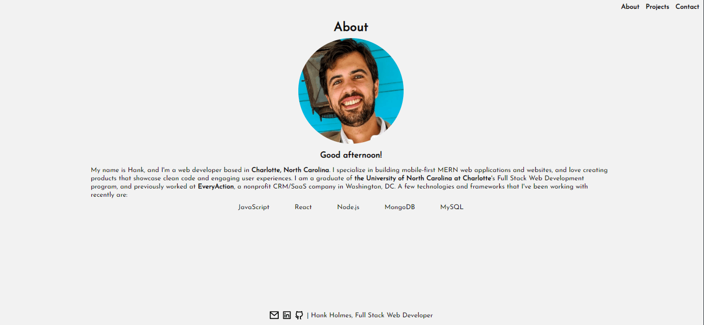
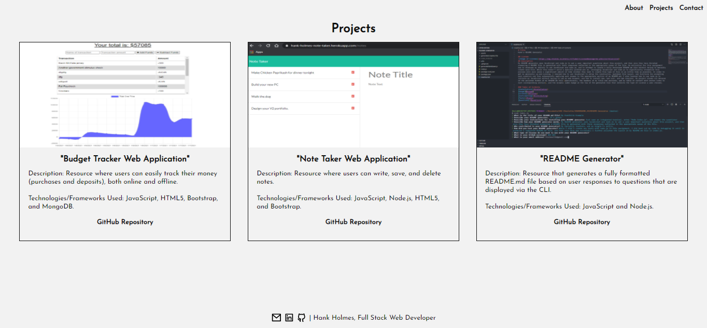
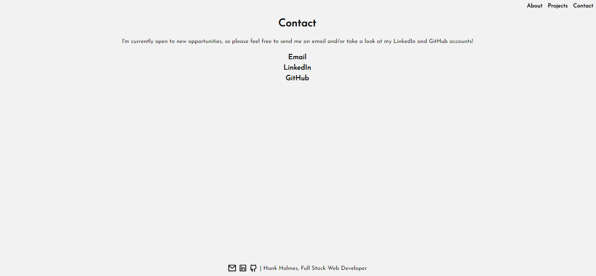

# V1_Portfolio

## Description
This is the first version of my post-graduation portfolio. My motivation for this was to design something that showcased my ability to write clean code, use React thoughtfully, and style everything with vanilla CSS. Please feel free to view my deployed portfolio [here](https://v1-portfolio-hank-holmes.herokuapp.com/).

## Table of Contents
[Installation](#installation)

[Usage](#usage)

[Contributing](#contributing)

[Tests](#tests)

[Questions](#questions)

### Installation
At the onset I created a React app, and then installed React-Router-Dom. After this, I created a set of javascript files to act as my "pages", and also "components" to eliminate as many redundent elements as possible.

### Usage
In order to use my application, all a user needs to do is visit my [deployed portfolio](https://v1-portfolio-hank-holmes.herokuapp.com/).

### Contributing
I designed and built this by myself, and relied on the open source icons provided by [RemixIcon](https://github.com/Remix-Design/RemixIcon).

### Questions
If you have any questions, please feel free to reach out to me via [Email](mailto:hholmes726@gmail.com).